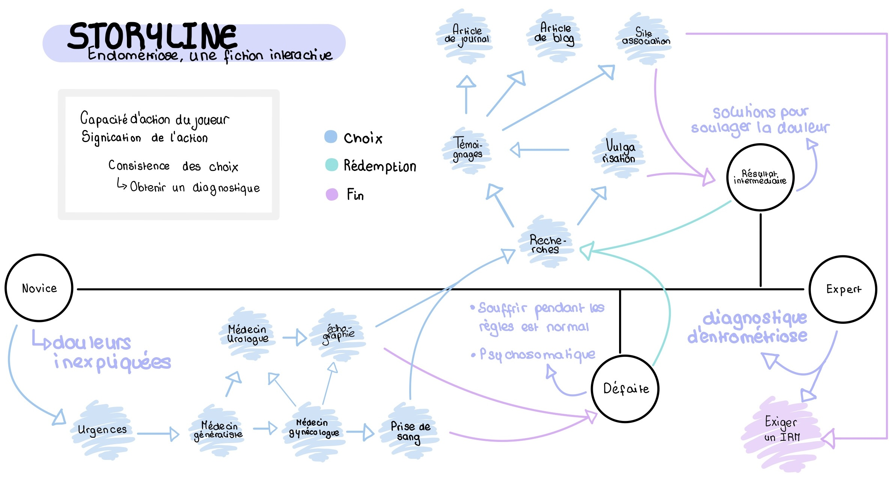

# EndlessDiagnostic
An interactive fiction about the endometriosis diagnostic journey and the difficulties encountered by patients in dealing with medical staff. 

# [You can play here.](https://titayna.itch.io/endlessdiagnostic)
## ONLY WORKS ON SAFARI NAVIGATOR AS FOR NOW

This game was created on both Ink and Unity as part of the [Interactive Fiction course](https://applicationspub.unil.ch/interpub/noauth/php/Ud/ficheCours.php?v_enstyid=88165&v_langue=fr) in the Masters in [Digital Humanities at the University of Lausanne](https://www.unil.ch/formations/en/home/menuinst/masters/humanites-numeriques.html).

### The sources of the information about endometriosis used are as follows: 

Castillo, Amanda. 2019. « Les maux des femmes sont sous-estimés par les médecins | Bilan ». [Consulté 28 juin 2023](https://www.bilan.ch/femmes-leaders/les-maux-des-femmes-sont-sous-estimes-par-les-medecins).

Cox, Helen, Lorraine Henderson, Natalie Andersen, Glenda Cagliarini, et Chantal Ski. 2003. « Focus Group Study of Endometriosis: Struggle, Loss and the Medical Merry-Go-Round ». International Journal of Nursing Practice 9(1):2‑9. [doi: 10.1046/j.1440-172X.2003.00396.x.](https://onlinelibrary.wiley.com/doi/abs/10.1046/j.1440-172X.2003.00396.x)

France 3 Occitanie. 2020. Ma thèse en 180 secondes : Oumaima El Mansouri. [Youtube video](https://www.youtube.com/watch?v=z62u2Io_wzs)

La Nouvelle République.fr. 2022. « Les femmes touchées par l’endométriose sont ciblées par les groupes sectaires ». [24/11/2022](https://www.lanouvellerepublique.fr/a-la-une/les-femmes-touchees-par-l-endometriose-sont-ciblees-par-les-groupes-sectaires).

LunaForHealth. s. d. « LUNA vous explique : le diagnostic de l’endométriose - Luna ». [Consulté 28 juin 2023](https://www.luna-endometriose.com/blog/endometriose/diagnostic-de-l-endometriose/).
